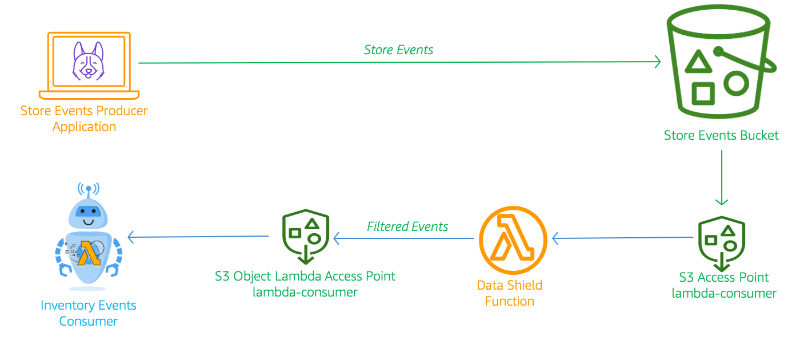
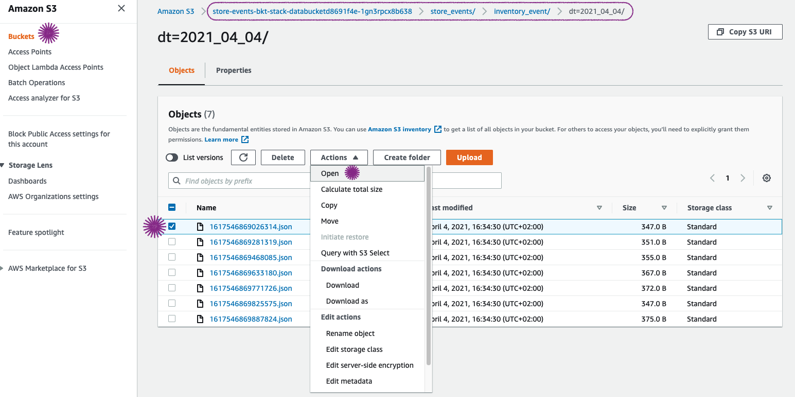
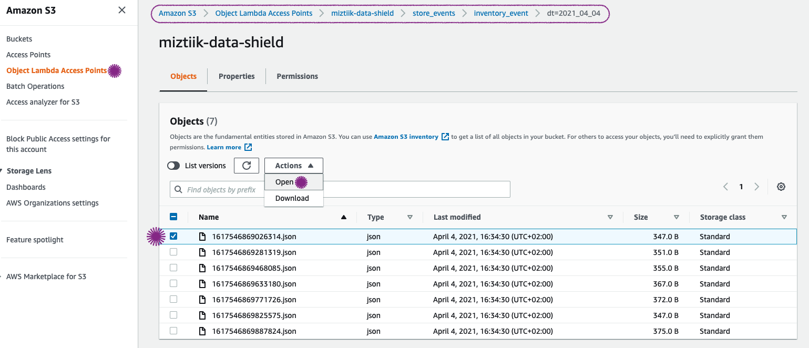
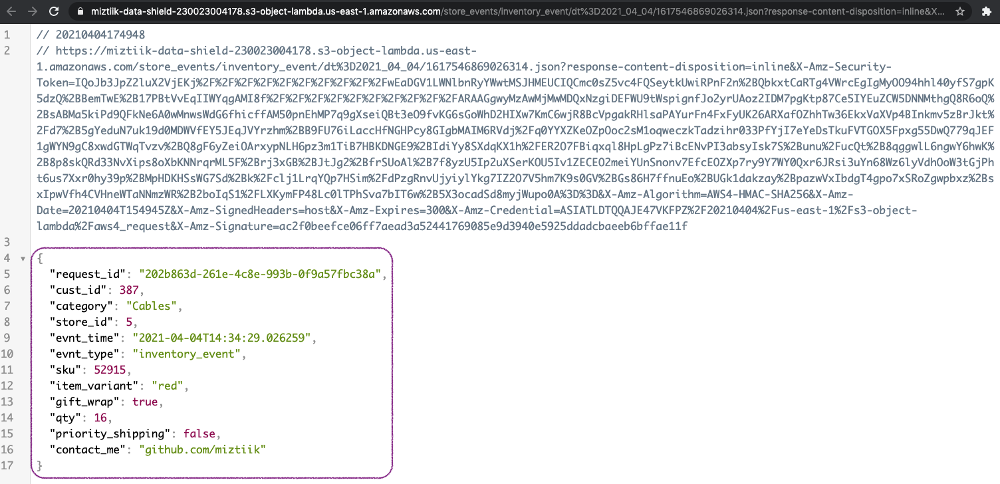

# S3 Object Lambda - Process S3 Retrieved Data Inflight

The developer at Mystique Unicorn are interested in building their application using event-driven architecture. For those who are unfamiliar, _An event-driven architecture uses events to trigger and communicate between decoupled services and is common in modern applications built with microservices. An event is a change in state, or an update, like an item being placed in a shopping cart on an e-commerce website._

In this application, they will have their physical stores, send _sales_ and _inventory_ related events to a central location like S3, where multiple downstream systems will consume these events. The event contains information about the product being ordered, price, discount and the store etc. A sample is provided below,

```json
{
  "request_id": "ac616b1d-1c7a-4c04-b2a4-c616dc7c5025",
  "cust_id": 563,
  "category": "Cables",
  "evnt_time": "2021-04-04T11:41:40.414235",
  "evnt_type": "inventory_event",
  "price": 32.41,
  "discount": 8.4,
  "sku": 60912,
  "item_variant": "red",
  "gift_wrap": true,
  "qty": 24,
  "priority_shipping": true,
  "contact_me": "github.com/miztiik",
  "bad_msg": true
}
```

Not all of this information need to be accessible to all consumers. For example, the consumers from the inventory department does not need to know the product price and discount being offered. Miztiik Unicorn is looking for a mechanism to filter out the sensitive information based on the consumer.

Can you help them achieve the same?

## 🎯 Solutions

With the recently launched AWS feature - S3 Object Lambda, you can add your own code to S3 GET requests to modify and process data as it is returned to an application. S3 Object Lambda relies on AWS Lambda functions to automatically process the output of each request.



In this demo, we will create a the architecture like the one shown above. We will create a producer of `store_events` using lambda and persist them in our store events bucket. To provide secure access the data by different consumers, we will create S3 Access Point<sup>[4],</sup> <sup>[5]</sup>. In our case, let us assume there will be a inventory customer running as a lambda function. We will call our access point `lambda-consumer`. This access point will be configured to execute a lambda function for all `GET` requests through its ARN. This lambda will redact the `discount` and `price` fields from the events and return to the user. We will use the GUI/CLI to simulate the consumer. A sample response is shown below.

```json
{
  "request_id": "ac616b1d-1c7a-4c04-b2a4-c616dc7c5025",
  "cust_id": 563,
  "category": "Cables",
  "evnt_time": "2021-04-04T11:41:40.414235",
  "evnt_type": "inventory_event",
  "sku": 60912,
  "item_variant": "red",
  "gift_wrap": true,
  "qty": 24,
  "priority_shipping": true,
  "contact_me": "github.com/miztiik",
  "bad_msg": true
}
```

1. ## 🧰 Prerequisites

   This demo, instructions, scripts and cloudformation template is designed to be run in `us-east-1`. With few modifications you can try it out in other regions as well(_Not covered here_).

   - 🛠 AWS CLI Installed & Configured - [Get help here](https://youtu.be/TPyyfmQte0U)
   - 🛠 AWS CDK Installed & Configured - [Get help here](https://www.youtube.com/watch?v=MKwxpszw0Rc)
   - 🛠 Python Packages, _Change the below commands to suit your OS, the following is written for amzn linux 2_
     - Python3 - `yum install -y python3`
     - Python Pip - `yum install -y python-pip`
     - Virtualenv - `pip3 install virtualenv`

1. ## ⚙️ Setting up the environment

   - Get the application code

     ```bash
      git clone https://github.com/miztiik/s3-object-lambda-demo
      cd s3-object-lambda-demo
     ```

1. ## 🚀 Prepare the dev environment to run AWS CDK

   We will use `cdk` to make our deployments easier. Lets go ahead and install the necessary components.

   ```bash
    # You should have npm pre-installed
    # If you DO NOT have cdk installed
    npm install -g aws-cdk

    # Make sure you in root directory
    python3 -m venv .venv
    source .venv/bin/activate
    pip3 install -r requirements.txt
   ```

   The very first time you deploy an AWS CDK app into an environment _(account/region)_, you’ll need to install a `bootstrap stack`, Otherwise just go ahead and deploy using `cdk deploy`.

   ```bash
    cdk bootstrap
    cdk ls
    # Follow on screen prompts
   ```

   You should see an output of the available stacks,

   ```bash
    store-events-bkt-stack
    store-events-producer-stack
    store-events-bkt-access-points-stack
    s3-object-lambda-stack
   ```

1. ## 🚀 Deploying the application

   Let us walk through each of the stacks,

   - **Stack: store-events-bkt-stack**

     This stack will create the s3 bucket to hold all our store events. We will add a bucket policy to delegate all access management to be done by access points<sup>[5]</sup>.

     Initiate the deployment with the following command,

     ```bash
     cdk deploy store-events-bkt-stack
     ```

     After successfully deploying the stack, Check the `Outputs` section of the stack. You will find the `StoreEventsBucket`.

   - **Stack: store-events-producer-stack**

     This stack will create the lambda function that will generate the events and write them to `StoreEventsBucket` under prefix `store_events`.

     Initiate the deployment with the following command,

     ```bash
     cdk deploy store-events-producer-stack
     ```

     After successfully deploying the stack, Check the Outputs section of the stack. You will find the `StoreOrdersEventsProducer` producer lambda function. We will invoke this function later during our testing phase.

   - **Stack: store-events-bkt-access-points-stack**

     At this point, we will create our S3 access points. We have the IAM role arns of our consumer applications. To keep it simple, we will use the following prefix to provide access,

     - **Access Point Name**: `lambda-consumer` with access only to **S3 Prefix**: `store_events`

     ```bash
     cdk deploy store-events-bkt-access-points-stack
     ```

     After successfully deploying the stack, Check the `Outputs` section of the stack. You will find the S3 Access Point Arn `LambdaConsumerAccessPointArn`. We will be using them during our testing to read/write to the `StoreEventsBucket` bucket.

   - **Stack: s3-object-lambda-stack**

     At this point, we have all created all the prerequisites necessary for setting up our S3 Object Lambda for our access point `lambda-consumer`.

     - First will create lambda that will remove the fields `discount` and `price` from the incoming event and send the response back. Our lambda will need the new IAM permission type created for object lambda `s3-object-lambda:WriteGetObjectResponse` to respond back to the request. You can learn more about the permissions required for object lambda here<sup>[2]</sup>.
     - Now we have our lambda function that can perform the redaction functionality, we will configure our object lambda access point `lambda-consumer` to process incoming requests.
     - Since this is a new functionality, the default boto3 packaged within lambda by AWS does not have the necessary libraries. I have packaged them as a _lambda layer_ that gets deployed along with the function.

     ```bash
     cdk deploy s3-object-lambda-stack
     ```

     After successfully deploying the stack, Check the `Outputs` section of the stack. You will find the S3 Object Lambda Access Point Arns `S3ObjectLambdaArn`. We will be using them during our testing to read/write to the `StoreEventsBucket` bucket.

     S3ObjectLambdaArn

1. ## 🔬 Testing the solution

   1. **Invoke Producer Lambda**:
      Let us start by invoking the lambda `StoreOrdersEventsProducer` from the producer stack using the AWS Console. If you want to ingest more events, invoke the lambda few times.

      ```json
      {
        "statusCode": 200,
        "body": "{\"message\": {\"status\": true, \"tot_msgs\": 12, \"bad_msgs\": 6, \"sales_evnts\": 5, \"inventory_evnts\": 7, \"tot_sales\": 562.13}}"
      }
      ```

      Here in this invocation, We have ingested about `12` messages. Within those message, we have `5` sale events and `7` inventory events with a total sale value of `562.13`.

   1. **Access Objects in S3**:

      Although we can do it through CLI/SDK, the most easier way is to do it through GUI/Console. We will first try to access the data from S3 Bucket access,_the normal way_

      - **S3 Console** >> **StoreEventsBucket** >> Navigate to an object, an example shown below. You should be able to receive a JSON document with the full data including `discount` and `price`.
        

      - Now to test if we the restricted access is working fine, let us use the new **Object Lambda Access Points** on the left pane.
      - **S3 Console** >> **Object Lambda Access Points** >> **`miztiik-data-shield`** >> Navigate to an object, an example shown below.
        

      You should be able to download a JSON that has the `discount` and `price` fields removed.
      

1. ## 📒 Conclusion

   Here we have demonstrated how to S3 Object lambda to process data requests in flight. You can extend this by adding a function to enrich the event with data from other sources.

1. ## 🧹 CleanUp

   If you want to destroy all the resources created by the stack, Execute the below command to delete the stack, or _you can delete the stack from console as well_

   - Resources created during [Deploying The Application](#-deploying-the-application)
   - Delete CloudWatch Lambda LogGroups
   - _Any other custom resources, you have created for this demo_

   ```bash
   # Delete from cdk
   cdk destroy

   # Follow any on-screen prompts

   # Delete the CF Stack, If you used cloudformation to deploy the stack.
   aws cloudformation delete-stack \
     --stack-name "MiztiikAutomationStack" \
     --region "${AWS_REGION}"
   ```

   This is not an exhaustive list, please carry out other necessary steps as maybe applicable to your needs.

## 📌 Who is using this

This repository aims to show how to use S3 object lambda to new developers, Solution Architects & Ops Engineers in AWS. Based on that knowledge these Udemy [course #1][102], [course #2][101] helps you build complete architecture in AWS.

### 💡 Help/Suggestions or 🐛 Bugs

Thank you for your interest in contributing to our project. Whether it is a bug report, new feature, correction, or additional documentation or solutions, we greatly value feedback and contributions from our community. [Start here](/issues)

### 👋 Buy me a coffee

[](https://ko-fi.com/Q5Q41QDGK) Buy me a [coffee ☕][900].

### 📚 References

1. [Docs: Creating Object Lambda Access Points][1]
1. [Docs: Configuring IAM policies for Object Lambda access points][2]
1. [Docs: S3 Object Lambda Event context format][3]
1. [Blog: Secure S3 With Access Points][4]
1. [Docs: Managing data access with Amazon S3 access points][5]

### 🏷️ Metadata


**Level**: 200

[1]: https://docs.aws.amazon.com/AmazonS3/latest/userguide/olap-create.html
[2]: https://docs.aws.amazon.com/AmazonS3/latest/userguide/olap-policies.html
[3]: https://docs.aws.amazon.com/AmazonS3/latest/userguide/olap-writing-lambda.html#olap-event-context
[4]: https://github.com/miztiik/secure-s3-with-access-points
[5]: https://docs.aws.amazon.com/AmazonS3/latest/userguide/access-points.html
[100]: https://www.udemy.com/course/aws-cloud-security/?referralCode=B7F1B6C78B45ADAF77A9
[101]: https://www.udemy.com/course/aws-cloud-security-proactive-way/?referralCode=71DC542AD4481309A441
[102]: https://www.udemy.com/course/aws-cloud-development-kit-from-beginner-to-professional/?referralCode=E15D7FB64E417C547579
[103]: https://www.udemy.com/course/aws-cloudformation-basics?referralCode=93AD3B1530BC871093D6
[899]: https://www.udemy.com/user/n-kumar/
[900]: https://ko-fi.com/miztiik
[901]: https://ko-fi.com/Q5Q41QDGK
